# Testgetriebene Infrastruktur als Code


***
- [Peter Rossbach | <peter.rossbach@bee42.com>](mailto:peter.rossbach@bee42.com) | [@PRossbach](https://twitter.com/PRossbach)
- [Andreas Schmidt | <andreas.schmidt@cassini.de>](mailto:andreas.schmidt@cassini.de) | [@aschmidt75](https:/twitter.com/@aschmidt75)
---
## Mein Rucksack

  * **Peter Rossbach**
    * Systemarchitekt
    * Java Entwickler
    * DevOps
    * Apache Tomcat Committer
    * Mitglied der Apache Software Foundation
    * Geschäftsführer der bee42 solutions GmbH
    * Autor
***
Peter schreibt gern IT-Geschichten und erzählt davon!

-
## Noch ein Rucksack ..

  * **Andreas Schmidt**
    * SW-Entwicklung (jetzt: Ruby)
    * Systemarchitekt
    * DevOps
    * (Netzwerk-)Security
    * Autor
    * Cassini Consulting
***

---
##Dev Ops

<=>

## You Build    It
## You Test     It
### You Run      It
### You Automate It
### You Measure  It
## You Change   It

---
## Plötzlich schlägt es ein....

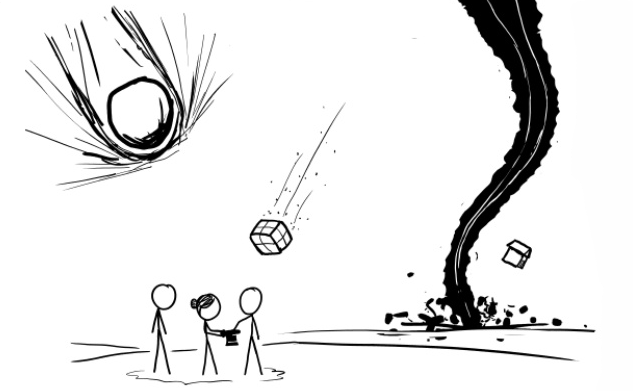

---
## TDD für Infrastruktur
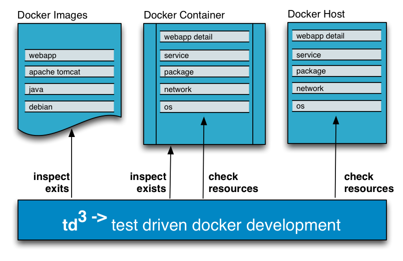

---
## Docker - MANTRA!
  - **B**uild, Ship and Run
  - **A**ny App,
  - **A**nywhere


-
### Docker Architektur
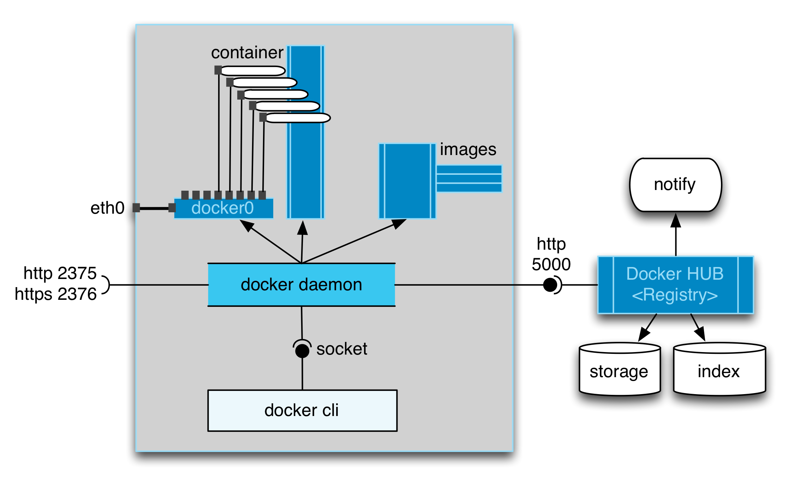
-
### Docker Layer
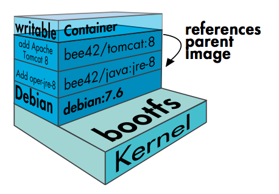
-
### Build Docker Images

```
FROM ubuntu:14.04

RUN apt-get update && apt-get upgrade -yq
#upgrade only to shell shocker fix
#RUN apt-get install --only-upgrade bash
RUN apt-get install -y apache2
RUN mkdir -p /var/lock/apache2 /var/run/apache2 /var/log/apache2

EXPOSE 80

CMD "source /etc/apache2/envvars && exec /usr/sbin/apache2 -DFOREGROUND"
```
---
### Anspruch

  * Teilen der Docker-Images
  * Nutzen von Docker-Images, statt selber entwickeln.
  * Eigene Inhalte hinzufügen
  * Optimierung
  * Infrastruktur Umgebung implementieren
    * Konfiguration
    * Netzwerk
    * Monitoring und Logging
    * Storage
  * Auto-Failover, Auto-Laodbalancing oder Zero-Downtime berücksichtigen
  * Entwicklung von Infrastruktur ist eine tägliche Herausforderung
***
Alles nur Software, oder...
-
### Irgendwie geht es immer
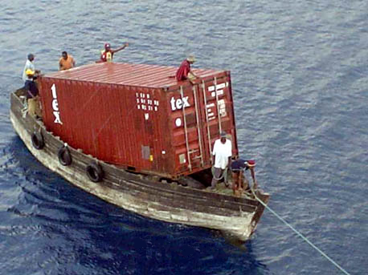
-
### Selbst bei bester Vorbereitung, ...
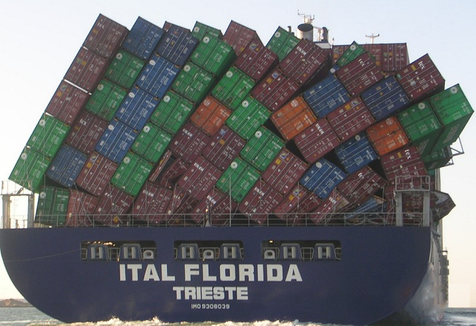
-
### Schlimme Unfälle passieren


-
### Herausforderungen

  * TDD seit Jahren Standard im Entwicklungsbereich
  * Einzug TDD ins Konfigurationsmanagement
    * z.B. Puppet + rspec-puppet
-
### Sind das nur "Ops"-Belange?
-
### DevOps

  * Konfigurationsmanagement-Code stammt auch aus der Entwicklung
  * Image-basierte Ansätze
  * Docker-Container stammen von Entwicklungs-Teams
-
### Build Chains produzieren nicht nur Anwendungssoftware

Build Chains produzieren Infrastruktur.
Diese sollte testbar sein.

---
## Testgetriebene Infrastruktur für Docker

### Vieles kann ich zeigen, aber nicht alles...
-
### Was behandelt der Talk nicht:


  * Integrationstest
    - [Jolokia TestFramework](https://github.com/rhuss/jolokia-it)
    - [Docker Maven Plugin](https://github.com/rhuss/docker-maven-plugin)
  * Loadtests
  * Komplexe Infrastruktur-Testsetups
    - [Chef Test Kitchen](http://kitchen.ci/)

-
###  Was behandelt der Talk:

  * Modellierung und Validierung einer Docker-Infrastruktur
    - [serverspec](http://serverspec.org)
    - [Docker-Container mit serverspec testen](http://www.infrabricks.de/blog/2014/09/10/docker-container-mit-serverspec-testen/)
  * Entwicklung von Artefakten => Dockerfile
    - Geht es nicht auch einfacher für Docker?
    - [Pieter Josst Van de Sande: TDD und Docker]( http://blog.wercker.com/2013/12/23/Test-driven-development-for-docker.html)
  * Modell zum Test der Infrastruktur (Docker-Host)
  * Ideen zur Verwaltung von Testspecs

-
### Weniger ist mehr und einfach besser!
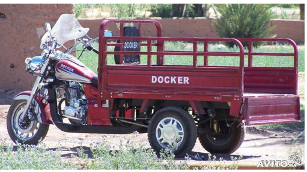
---
## Handwerker bei der Arbeit...


---
## Test Driven Development für Docker

  * Starte mit einem gebrochenen Test
    * Verifizere das der Test wirklich fehlschlägt
    * Implementiere den Fix oder die Eigenschaft
    * Lasse den Test erneut laufen
    * Verifiziere, das er nun erfolgreich ist.
    * Prüfe, ob nun nichts andere fehlschlägt!
    * Optimiereren
  * Wiederhole das Verfahren bis das System die gewünschten Eigenschaften hat.
-
### TDD- Arbeitsweise
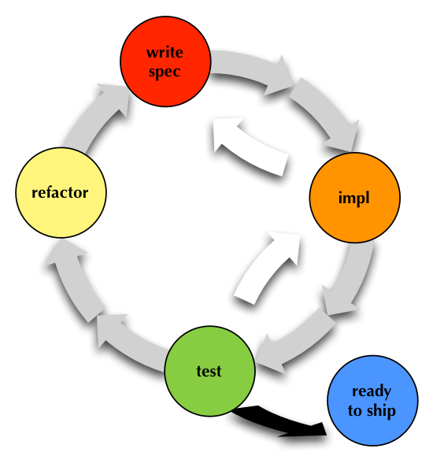

---
## Bereitstellen eines Apache Tomcat Docker-Image

  * Anlage des Tests und Start der Programmierung des Images
  * Bereitstellen des Services
    * Port 8080
    * Java Package
    * Apache Tomcat Package
    * Apache Tomcat starten
  * mehr...
-
### TDD Docker Umgebung

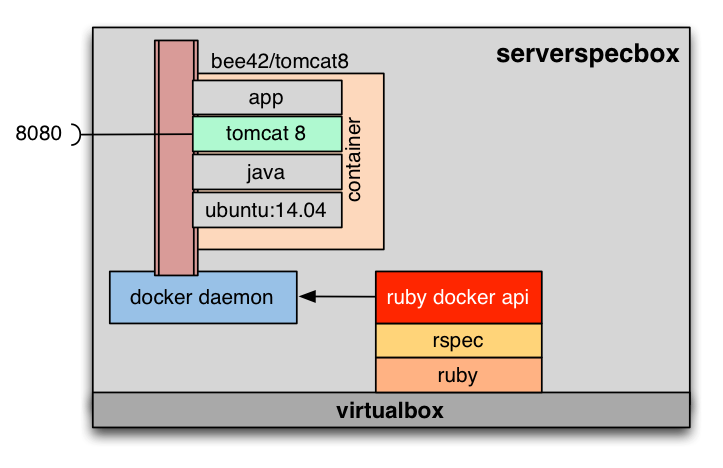

-
### Teste die Verfügbarkeit des Images

  * Nutze von Ruby und RSpec zur Formulierung der Tests
  * Nutze das Ruby Docker API

```bash
$ mkdir -p tomcat/spec
$ cd tomcat/spec
$ vi tomcat_specs.rb
```

-
### Erster Test

```ruby
require 'docker'

describe "apache tomcat8 image" do
    before(:all) {
        @image = Docker::Image.all().
        detect{|i| i.info['RepoTags'].
        detect{|r| r == "bee42/tomcat:8"}}
    }

    it "should be available" do
        expect(@image).to_not be_nil
    end
end
```
***
[Ruby Docker API](https://github.com/swipely/docker-api)

-
### Ausführen der Tests

**Gemfile**
```ruby
source 'https://rubygems.org'
ruby '2.1.2'

gem 'rspec', '~> 2.99'
gem 'docker-api', '~>1.13.2'
```

**Ausführen**
```bash
cd ..
vi Gemfile
bundle install --path vendor
echo 'alias tdd="bundle exec rspec $@"' >> ~/.bash_aliases
source . ~/.bash_aliases
```
-
### Fehlschlag war ja gewünscht!

```bash
$ tdd spec/tomcat_spec.rb
F

Failures:

  1) apache tomcat8 image should be availble
     Failure/Error: expect(@image).to_not be_nil
       expected: not nil
            got: nil
     # ./spec/tomcat_spec.rb:9:in `block (2 levels) in <top (required)>'

Finished in 0.12047 seconds
1 example, 1 failure

Failed examples:

rspec ./spec/tomcat_spec.rb:8 # apache tomcat8 image should be availble
```
-


-
### Zeit das erste Ergebnis zu bewahren...

```bash
$ git config --global user.email "peter.rossbach@bee42.com"
$ git config --global user.name "Peter Rossbach"
$ vi .gitignore
$ git init
$ git add .
$ git commit -m "Setup at first failing test"
```

**.gitignore**
```
.DS_Store
Gemfile.lock
vendor
.bundle
```

-
### Erzeuge eine erste Version des Images


```bash
$ mkdir -p docker/bee42/tomcat8
$ cd docker/bee42/tomcat8
$ vi Dockerfile
$ docker build -t="bee42/tomcat:8" .
Sending build context to Docker daemon  2.56 kB
Sending build context to Docker daemon
Step 0 : FROM ubuntu:14.04
 ---> 96864a7d2df3
Step 1 : MAINTAINER Peter Rossbach <peter.rossbach@bee42.com>
 ---> Using cache
 ---> 9ec0f7eb38d8
Successfully built 9ec0f7eb38d8
$ docker images | grep 'bee42/tomcat:8'
bee42/tomcat8              latest              9ec0f7eb38d8        24 hours ago        204.4 MB
```

**docker/bee42/tomcat8/Dockerfile**
```
FROM ubuntu:14.04
MAINTAINER Peter Rossbach <peter.rossbach@bee42.com>
```
-
### Teste erneut

```
$ cd ../../..
$ tdd spec/tomcat_spec.rb
.

Finished in 0.10493 seconds
1 example, 0 failures
```

-


-
### Wiederholbarkeit organisieren

```
$ vi build.sh
$ chmod -x build.sh
$ ./build.sh
```

-
### Starte erneut und sichere das Ergebnis

**build.sh**
```bash
#!/bin/bash
echo "Building docker image:"
cd docker/bee42/tomcat8
docker build -t=bee42/tomcat8 .
echo
cd ../../..
echo "Executing tests:"
bundle exec rspec spec/tomcat_spec.rb
```

```bash
git add .
git commit -m "add content of images, build it and check that is available at local docker repo"
```

---
### Hinzufügen des nächsten Testcases

```ruby
  it "should expose the default tomcat tcp port" do
      expect(@image.json["Config"]["ExposedPorts"]).
      to include("8080/tcp")
  end
```

-
### Ohne Installation des httpd gelingt der Test nicht!
```
Executing tests:
.F

Failures:

  1) apache tomcat8 image should expose the default tomcat tcp port
     Failure/Error: expect(@image.json["Config"]["ExposedPorts"]).to include("8080/tcp")
     NoMethodError:
       undefined method `include?' for nil:NilClass
     # ./spec/tomcat_spec.rb:13:in `block (2 levels) in <top (required)>'

Finished in 0.11131 seconds
2 examples, 1 failure

Failed examples:

rspec ./spec/tomcat_spec.rb:12 # apache tomcat8 image should expose the default tomcat tcp port
```
-


-
### Dockerfile
```
FROM ubuntu:14.04
MAINTAINER Peter Rossbach <peter.rossbach@bee42.com>

EXPOSE 8080
```
Success
```
$ ./build.sh
Building docker image:
Sending build context to Docker daemon  2.56 kB
Sending build context to Docker daemon
Step 0 : FROM ubuntu:14.04
 ---> 96864a7d2df3
Step 1 : MAINTAINER Peter Rossbach <peter.rossbach@bee42.com>
 ---> Using cache
 ---> 9ec0f7eb38d8
Step 2 : EXPOSE 8080
 ---> Using cache
 ---> 8e2f8e5a7e4b
Successfully built 8e2f8e5a7e4b

Executing tests:
..

Finished in 0.12662 seconds
2 examples, 0 failures
```
-


---
### Prüfe, ob java installiert ist

```ruby
describe "running java" do
    before(:all) {
      @container = Docker::Container.create(
         'Image' => 'bee42/tomcat8:latest',
         'Cmd' => ['java', '-version'],
         'Tty' => true)
    }
    after(:all) do
        @container.kill
        @container.delete(:force => true)
    end
    it "is java expected" do
      expect(@container.tap(&:start).
      attach(:tty => true)[0][0]).to include( "1.7.0_65")
    end
end
```
***
Hups, der Test hängt manchmal!
-


-
### Java Package Installation

**Dockerfile**
```
RUN apt-get update && \
  apt-get install -yq openjdk-7-jre-headless
```

  * Prüfe den Erfolg
  * git checkin

-


---
### Prüfe die Apache Tomcat Installation

```ruby
describe "check tomcat version" do
    before(:all) {
      @container = Docker::Container.create(
            'Image' => 'bee42/tomcat:8',
            'Cmd' => '/opt/tomcat/bin/version.sh',
            'Tty' => true)
    }
    after(:all) do
        @container.kill
        @container.delete(:force => true)
    end
    it "is tomcat expected" do
      expect(@container.tap(&:start).
      attach(:tty => true)[0][2]).
      to include( "Apache Tomcat/8.0.12")
    end

end
```
-


-
### Installation der Apache Tomcat Package

**Dockerfile**
```
...

RUN apt-get install -yq wget
RUN wget -q https://archive.apache.org/dist/tomcat/tomcat-8/v8.0.12/bin/apache-tomcat-8.0.12.tar.gz
RUN mv apache-tomcat* /opt/tomcat
```
-


-
### Prüfe, ob der Tomcat wirklich läuft

```ruby
require 'net/http'
...
describe "running tomcat as a container" do
    before(:all) do
        # docker run -d -p 8080:8080 bee42/tomcat8 \
        # /opt/tomcat/bin/catalina.sh run
        id = `docker run -d -p 8080:8080 bee42/tomcat8 /opt/tomcat/bin/catalina.sh run`.chomp
        @container = Docker::Container.get(id)
        sleep 3
        uri = URI('http://127.0.0.1:8080/index.jsp')
        @res = Net::HTTP.get_response(uri)
    end
    after(:all) do
        @container.kill
    end
    it "should accept connection to the container tomcat port" do
        expect(@res.code).to match '200'
    end

end
```
-
### Erfolg auf der ganzen Line

```
$ tdd spec/tomcat_spec.rb
.....

Finished in 7.38 seconds
5 examples, 0 failures
```

-


---

### Optimierung des Images

**Dockerfile**
```
ENV TOMCAT_MAJOR_VERSION 8
ENV TOMCAT_MINOR_VERSION 8.0.12
ENV CATALINA_HOME /opt/tomcat

RUN apt-get install -yq wget

RUN wget -q https://archive.apache.org/dist/tomcat/tomcat-${TOMCAT_MAJOR_VERSION}/v${TOMCAT_MINOR_VERSION}/bin/apache-tomcat-${TOMCAT_MINOR_VERSION}.tar.gz && \
    wget -qO- https://www.apache.org/dist/tomcat/tomcat-${TOMCAT_MAJOR_VERSION}/v${TOMCAT_MINOR_VERSION}/bin/apache-tomcat-${TOMCAT_MINOR_VERSION}.tar.gz.md5 | md5sum -c - && \
    tar zxf apache-tomcat-*.tar.gz && \
    rm apache-tomcat-*.tar.gz && \
    mv apache-tomcat* ${CATALINA_HOME}

```
-


---
## Squashing

  * Images sind sehr gross!
    * 350Mb für einen Tomcat...
  * Reduktion der einzelen Layer auf das notwendig!
  * Löschen was nicht gebraucht wird!
    * Temporäre Datei und Caches entfernen.
    * Dokumentation braucht man nicht mehr zur Runtime.
    * Build Packages löschen - Heroku Buildpacks sind grauenvoll!
    * Ein Compiler gehört nicht in die Produktion.
    * Die richtige Wahl des Base Images (debootstrap!)

***
[Squashing Docker Images](http://jasonwilder.com/blog/2014/08/19/squashing-docker-images/)
[Scratch  Image](http://blog.xebia.com/2014/07/04/create-the-smallest-possible-docker-container/)
-
### squash skript
```bash
#!/bin/bash
DATE=`date +'%Y%m%d%H%M'`
ACCOUNT=bee42
IMAGE=tomcat8
IMAGETAG=${ACCOUNT}/${IMAGE}:${DATE}

echo "= build image $IMAGETAG"
cd docker/bee42/tomcat8
docker build -t="$IMAGETAG" .
BUILDID=$(docker inspect -f "{{.Id}}" $IMAGETAG)

echo "= squash image $IMAGETAG"
docker save $BUILDID | docker-squash -t $IMAGETAG-squash -from root | docker load
SQUASHID=$(docker inspect -f "{{.Id}}" $IMAGETAG-squash)
docker tag $SQUASHID ${ACCOUNT}/${IMAGE}:latest

if [ "$1" == "-rmi" ] ; then
  echo "= remove build image $IMAGETAG with id $BUILDID"
  docker rmi $BUILDID
fi
```
-
### Schmeisse gelöschte Teile aus dem Image

```
= squash image bee42/tomcat8:201409241010
$ docker images
```

| REPOSITORY | TAG |IMAGE ID | VIRTUAL SIZE |
| ---------- | -------- | -- |------------ |
| bee42/tomcat8 | 201409241010-squash | 7dbd7dd03726 | 312 MB |
| bee42/tomcat8 | 201409241007 | dc2af8867b3c | 350 MB |
--
### Test it!
```
$ ls
build.sh  docker  Gemfile  Gemfile.lock  spec  squash.sh  vendor
$ tdd spec/tomcat_spec.rb
.....

Finished in 8.43 seconds
5 examples, 0 failures
```
-


---
## Die nächsten Herausforderungen warten

  * Cleanup der Installation
  * Verwendung von Oracle Java
  * Konfiguration des Servers
    * eigene server.xml
    * eigene Tomcat Erweiterung (JDBC, ...)
  * Integration der eigenen Anwendungen
  * Integration von Logging und Monitoring
  * Erzeugen einer Tomcat Familie (6/7/8 alle Releases)
  * Automatisierung CI!
  * Abhängigkeitsmanagement
  * Folgen eines Squashing abschätzen
    * Keine Wiederverwendung der Base Images, wenn daraus gelöscht wird!
-
### bee42 startet die **infrabricks docker line**!
  * [rossbachp/tomcat8](https://github.com/rossbachp/dockerbox/tree/master/docker-images/tomcat8)
***
Leider noch ohne Tests, aber das wird bald!

---
# Einer geht noch!

  * Eleganz beim Testen mit serverspec
  * Verschiedene Backends
  * Erleichterung der Formulierung der Checks
  * Erleichterung der Formulierung von Matches
  * Testen einer ganzen Infrastruktur
***
Serverspec Release 2.0 ist im Oktober herausgekommen.
-
### Beispiel
```ruby
require 'spec_helper'

describe package('httpd') do
  it { should be_installed }
end
describe service('httpd') do
  it { should be_enabled   }
  it { should be_running   }
end
describe port(80) do
  it { should be_listening }
end
describe file('/etc/httpd/conf/httpd.conf') do
  it { should be_file }
  its(:content) { should match /ServerName www.example.jp/ }
end
```

-
### Beispiel für Docker-Container (ab version 2.3.0)

```ruby
describe docker_image('busybox:latest') do
  it { should exist }
  its(['Architecture']) { should eq 'amd64' }
  its(['Config.Cmd']) { should include '/bin/sh' }
end

describe docker_image("bee42/tomcat:8") do
  its(['Config.Cmd']) { should include '/opt/tomcat/bin/catalina.sh' }
end

describe docker_container('tomcat8') do
  it { should exist }
  it { should be_running }
  it { should have_volume('/tmp', '/data') }
  its(['HostConfig.NetworkMode']) { should eq 'bridge' }
end
```

-
### ServerSpec Architektur
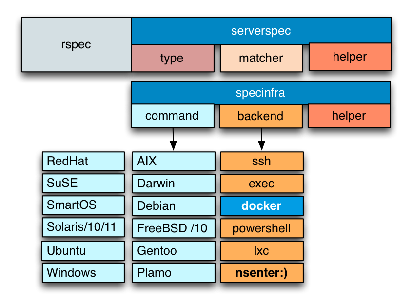

-
### Die wirkliche Herausforderung

  * Testen im Container
    * Deployment von Serverspec in den Container
    * Testen des Container mit SSH
    * Testen des Container mit nsenter

-
### Serverspec im Container
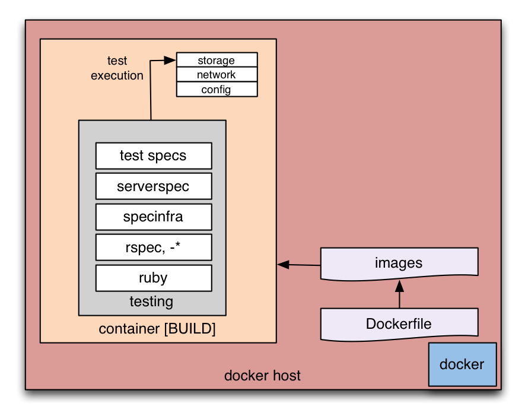

-
### Serverspec mit ssh
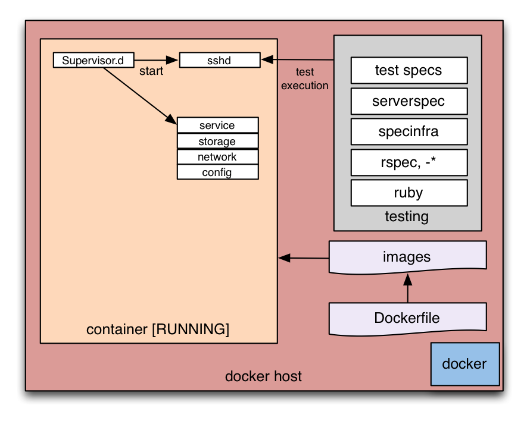

-
### Serverspec mit nsenter
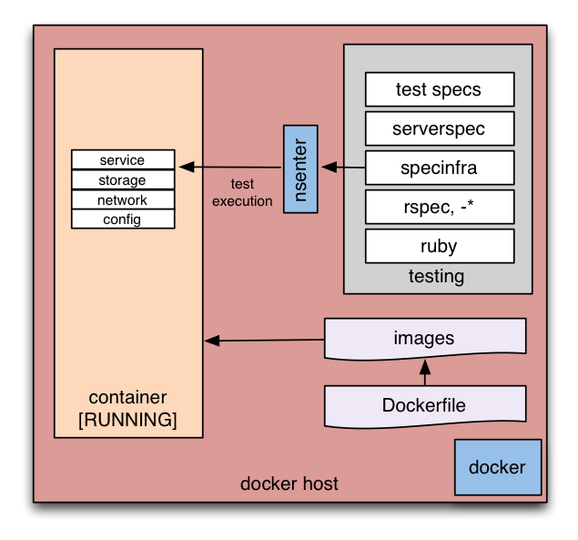

***
  - Nichts für schwache Nerven : [ServerspecBox](https://github.com/rossbachp/serverspecbox.git)
  - Support für `docker exec` (Docker 1.3) in der Planung

-
#### Beispiel container_nsenterpid_spec.rb
```ruby
require 'serverspec'

set :os, :arch => 'x86_64', :family => 'debian', :distro => 'ubuntu', :release => 14
set :backend, :nsenter
set :docker_cid, "tomcat8"
set :nsenter_pid, nil

puts "#{Specinfra.configuration.docker_cid}"

describe package('wget') do
  it { should be_installed }
end
```
---
## Tipps

  * Mache kleine Schritte, die sinnvoll aufeinander aufbauen!
  * Sicherer die Zwischenergebnisse
    * Bessere Nachvollziehbarkeit
    * Analyse des Wegs, macht die nächste Schätzung besser
  * Übung macht den Meister!
  * Verpacken der Testumgebung in einen Docker Container!

---
## Aufbau von Testspezifikationen

  * Server
    * besitzen `Rollen`: Web-, App- DB-Server
    * haben `Konfiguration` je nach Umgebung: Dev, Prd
    * unterscheiden sich in `Aspekten`: OS, Netzwerk, Applikation, Security

-
## Organisation von Testspezifikationen

  * Spec in `Host', `Container`, `Roles` und `Tags`
  * Wiederverwendbarkeit von Tests durch Konfigurationen
    - Einbinden von Properties
  * Reporting automatisieren

```
spec
├── all
│   ├── lldpd_spec.rb
│   └── network_spec.rb
├── memcache
│   └── memcached_spec.rb
└── web
    └── apache2_spec.rb
```

***
[Vincent Bernat](https://github.com/vincentbernat/serverspec-example.git)  
-
### Beispiel mit Tag
```ruby
describe file('/data/images'), :tag => "paris" do
  it { should be_mounted.with( :type => 'nfs' ) }
end
```

---
## Triple-E Inspriationen

  * **E**conomy of scale
  * **E**nergy efficient
  * **E**nvironmentally improved
-
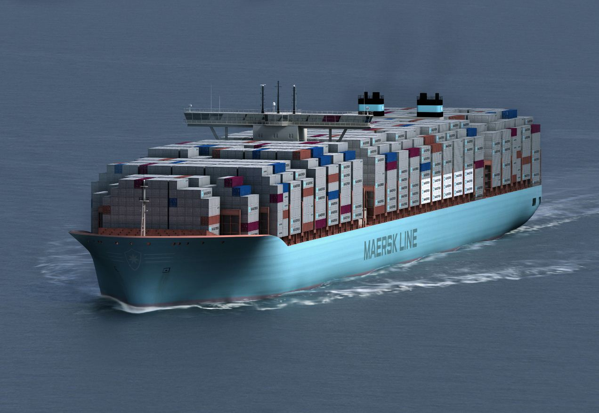

-
### General characteristics

|Attribute| Wert|
| -- | -- |
| Type | Container ship |
| Tonnage | 165,000 DWT  |
| Displacement | 55,000 tonnes (empty) |
| Length | 400 m (1,312 ft) |
| Beam | 59 m (194 ft) |
| Draft | 14.5 m (48 ft) |
| Propulsion | Twin MAN engines, 32 MW each  |
| Capacity | 18,340 TEU  |
| Notes | Cost $185 million |

***
[Maersk_Triple_E](http://en.wikipedia.org/wiki/Maersk_Triple_E_class)

-


-
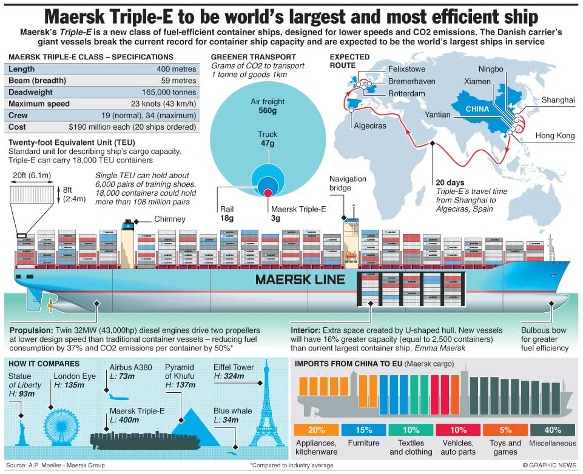

-
### Erfolgsstory

  * 2010 geplant
  * Juli 2013 wird das erste Schiff in Betrieb genommen
  * August 2014 12 Schiffe in Betrieb und 8 in Bau!
  * Regelbetrieb aufgenommen

---
## Modellbau ...
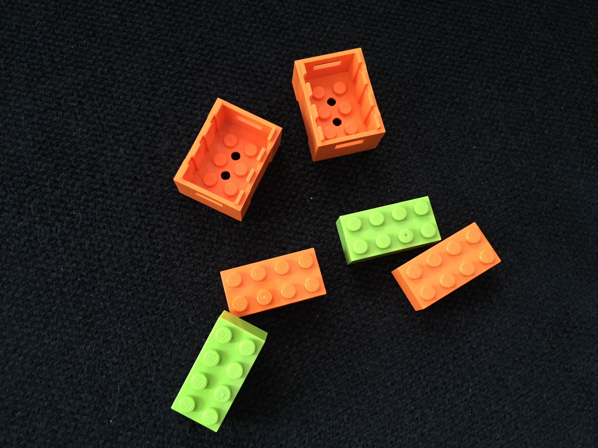
-
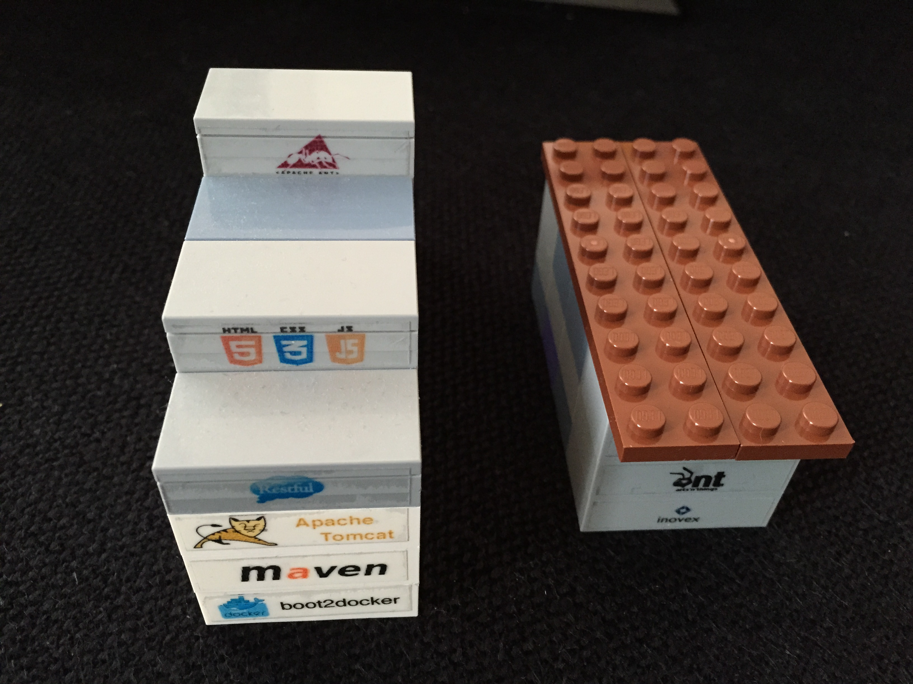
-
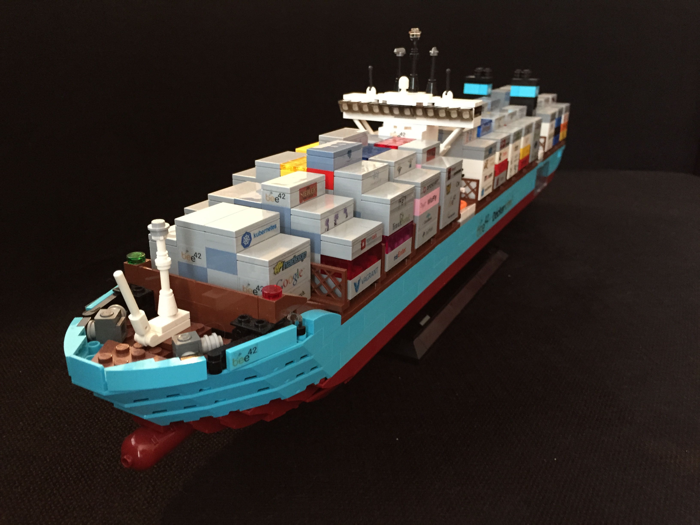
-
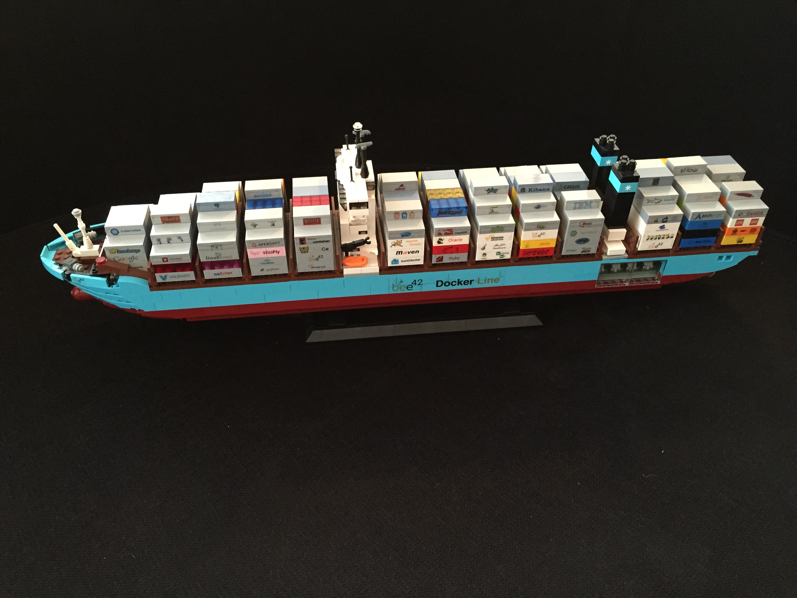
-
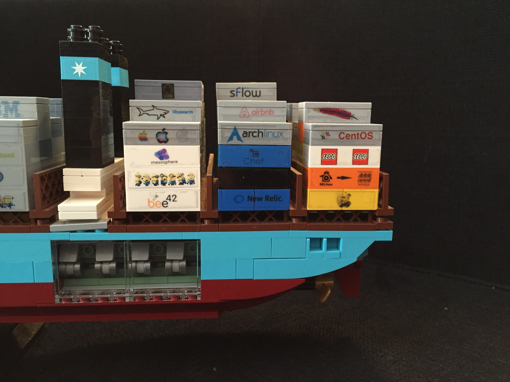
-
### MS unverbesserlich...
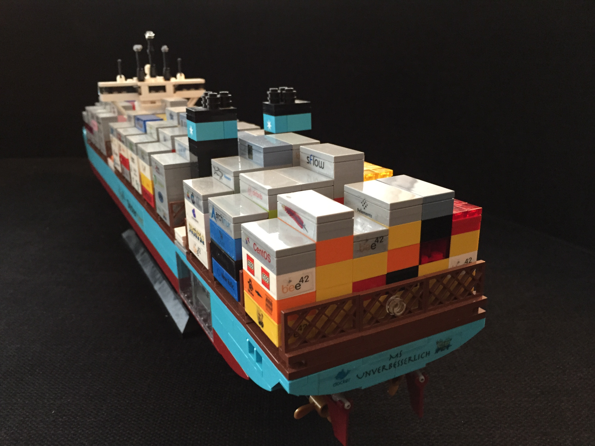

---
### bee42 infrabricks line sucht Dich...

  - Teamplayer
  - DevOps
  - Interesse an Infrastrukturentwicklung
  - Linux Admin auf der Suche nach einer Herausforderung
  - Containerbauer gesucht!

***
[bee42 solutions gmbh](http://www.bee42.com)
---
## Bewertung

  - Beitrag zur Stabilität der Docker Container-Entwicklung
  - Vorgehen ein Docker-Images mit Qualität zu erschaffen.
  - Seht es als notwenige Massnahme die Änderbarkeit und Erhalt  zu sichern
  - Prüfen, ob ein Docker-Container bestimmte Normen erfüllt
    - Die Kombination nsenter+serverspec ist viel versprechend!
  - Testorganisation ist notwendig

***
Der Anfang ist gemacht, aber mehr muss noch getan werden!

[Beispiel der TDD Apache Tomcat reference implementation](md/tomcat-reference.tar.gz)

---
## Fazit

  * Es geht bei der Entwicklung von Docker-Images um
    - Disziplin,
    - Rhythmus,
    - Qualitätsanspruch
    - und Taktgefühl.
  * Testgetriebene Infrastruktur-Entwicklung sichert den Erfolg.
  * Ein inkrementelles Vorgehen schafft Qualität.
  * Testen ist eine Chance für schnellen Know How-Erwerb.
***
Der Umgang mit RSpec und Ruby benötigen einige Übung.
***
BDD Alternativen im Java Space:
  * [Spock](https://code.google.com/p/spock/)
  * [Jbehave](http://jbehave.org/)
-
### Das solltet Ihr besser können!


---
## Einer geht noch...
---
## Docker Entwickler Spezial Magazin

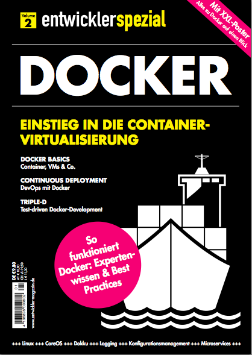
***
  * Mitte November 2014 im Buchhandel
  * Vorbestellung ab Ende der Woche auf der Seite `https://entwickler.de/magazin`

---
## Die neue DevOps-Community braucht Dich!

bee42 solutions gmbh hat den Bau seiner **Infrabricks Line** begonnen!

***
  * Peter Rossbach
    * Systemarchitekt
    * Java Entwickler
    * DevOps und Infra-Coder mit Herz
    * Apache Tomcat Committer
    * Mitglied der Apache Software Foundation
    * Geschäftsführer der bee42 solutions gbmh
    * Autor

***
Peter erzählt gern IT-Geschichten!
-
### Nächsten Streiche

  * Mitte November 2014 erscheint ein Docker-Sonderheft
    * Basis KnowHow und realler Einsatz von Docker
    * Docker-Poster
  * [WJAX 2014 3-7.11.2014](https://jax.de/wjax2014/)
    * DevOps-Days
    * Docker-Workshop
    * Diskussion
  * [Continuous Lifecycle](http://www.continuouslifecycle.de/)
  * Q2 2015: Buch zum Thema Docker!

-
### Kontakt

Folien dieses Vortrags
```bash
docker run -tid -p 8000:8000 rossbachp/tdd-docker-wjax:2014
```
**Available at 10.11.2014***

  * [<peter.rossbach@bee42.com>](mailto:peter.rossbach@bee42.com)
  * [@PRossbach](http://twitter.com/PRossbach)
  * [<andreas.schmidt@cassini.de>](mailto:andreas.schmidt@cassini.de)
  * [@aschmidt75](https:/twitter.com/@aschmidt75)
  * [Infrabricks Blog](http://www.infrabricks.de)
  * [bee42](http://www.bee42.com)

-
### Links

  * [Blog Infrabricks](http://www.infrabricks.de)
  * [PIETER JOOST VAN DE SANDE: TDD und Docker]( http://blog.wercker.com/2013/12/23/Test-driven-development-for-docker.html)
  * [rspec](http://rspec.info/)
  * [Ruby net http client](http://ruby-doc.org/stdlib-2.1.3/libdoc/net/http/rdoc/Net/HTTP.html)
  * [Ruby Docker API](https://github.com/swipely/docker-api)
  * [Apache Tomcat](http://tomcat.apache.org)
  * [Chris Jones - Missing Guide to boot2docker](http://viget.com/extend/how-to-use-docker-on-os-x-the-missing-guide)

-
### Mehr zu Serverspec
  * Serverspec
    * [serverspec](http://serverspec.org/)
    * [sepcinfra](https://github.com/serverspec/specinfra)
    * [rspec](http://rspec.info/)
  * [ServerspecBox](https://github.com/rossbachp/serverspecbox.git)
  * [Docker Container mit Serverspec testen](http://www.infrabricks.de/blog/2014/09/10/docker-container-mit-serverspec-testen/)
  * [Security-Tests mit Serverspec](http://www.infrabricks.de/blog/2014/06/12/security-tests-mit-serverspec/)
  * [Infrataster und Serverspec: Blackbox- und Whitebox-Testing](http://www.infrabricks.de/blog/2014/05/22/blackbox-und-whitebox-testing/)
  * [Serverspec mit Vagrant verbinden](http://www.infrabricks.de/blog/2014/05/09/serverspec-mit-vagrant-verbinden/)
  * [Serverspec Standalone betreiben](http://www.infrabricks.de/blog/2014/05/07/serverspec-standalone-betreiben/)
  * [Serverspec: Server spezifizieren und testen](http://www.infrabricks.de/blog/2014/04/25/serverspec-server-spezifizieren-und-testen/)
  * Präsentationen
    * [OSDC 2014 Andreas Schmidt: Testing server infrastructure with serverspec](http://www.slideee.com/slide/osdc-2014-andreas-schmidt-testing-server-infrastructure-with-serverspec)
